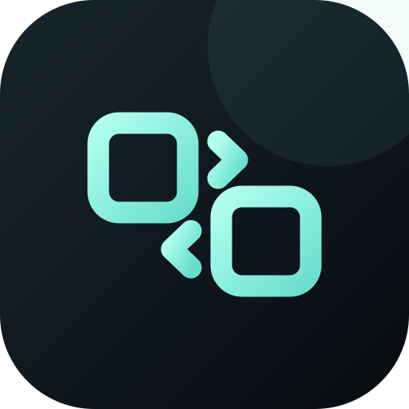
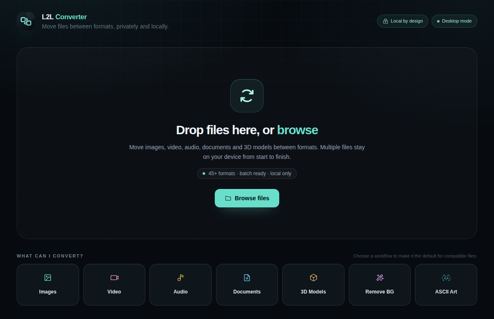

<p align="center">
  
</p>

<h1 align="center">⚡ L2L Converter</h1>

<p align="center">
  <strong>Local batch file converter</strong> — images, video, audio, documents & 3D meshes.<br/>
  No cloud. No account. No uploads. Everything runs on your device.
</p>

<p align="center">
  <a href="LICENSE"></a>
  <a href="#privacy--safety"></a>
  <a href="package.json"></a>
  <a href="package.json"></a>
  <a href="package.json"></a>
  <a href="package.json"></a>
  <a href="CONTRIBUTING.md"></a>
</p>

<p align="center">
  
</p>

---

## ✨ Features

- 🗂️ **Batch conversion** — drop hundreds of files, convert them all at once (2 parallel workers, live per-file progress).
- 🔇 **Fully local** — every conversion runs in-process with bundled engines. The app works with the internet cable pulled.
- 🪄 **Remove background** — one-click background removal to transparent PNG (flood-fill algorithm, no model download).
- 🔤 **ASCII art** — turn any photo into monospace text art (`.txt`) with 2× supersampling + contrast stretching.
- 🧊 **3D meshes** — convert between STL · OBJ · PLY · 3MF · GLB, right on your device.
- 🎬 **Media** — video repack/transcode and audio extraction with a bundled FFmpeg.
- 📄 **Documents** — PDF ↔ images/text, Markdown/HTML/DOCX → PDF, CSV ↔ XLSX.
- 💎 **Best quality, always** — automatic encoder settings; no confusing quality sliders.
- 🔒 **Safe by design** — inputs are never overwritten, outputs get unique names, and defensive limits block oversized or malicious files.

## 🎯 What it converts

| Area | Inputs | Outputs |
| --- | --- | --- |
| 🖼️ Images | PNG · JPG · WebP · GIF · AVIF · TIFF · BMP · SVG | PNG · JPG · WebP · GIF · AVIF · TIFF · PDF · transparent PNG · ASCII text |
| 🎞️ Video | MP4 · MKV · WebM · MOV · AVI · MPEG · WMV · FLV · 3GP · M4V · OGV | MP4 · WebM · MKV · MOV · AVI · MPEG · OGV · GIF · MP3 |
| 🎵 Audio | MP3 · WAV · FLAC · OGG · M4A · AAC · WMA · OPUS · AIFF · AC3 · more | MP3 · WAV · FLAC · OGG · M4A · AAC · OPUS · AIFF · AC3 |
| 📄 Documents | PDF · TXT · Markdown · HTML · DOCX · CSV · XLSX | PDF · HTML · TXT · PNG · JPG · WebP · CSV · XLSX |
| 🧊 3D meshes | STL · OBJ · PLY · 3MF · GLB | STL · OBJ · PLY · 3MF · GLB |

> **49 input formats**, every conversion verified by an automated format-matrix test — see [ARCHITECTURE.md](ARCHITECTURE.md#conversion-pipeline).

## ⚙️ How it works

L2L is a **static Next.js renderer inside Electron**. The UI you see is a normal
React app, but it has **no access to Node.js or your filesystem directly** —
everything goes through a narrow, typed bridge into the Electron main process.

```
React renderer → typed preload bridge → Electron main → converter engines
                                                     └──────→ local output files
```

- **Batch queue** — drop hundreds of files; L2L processes them two at a time
  with live per-file progress, so a big batch keeps the UI responsive.
- **Format matrix** — `shared/formats.ts` is the single source of truth: for
  every extension it knows which category it belongs to and which target
  formats are allowed. The UI *and* the converters read from the same table,
  so what you see is exactly what can be done.
- **Engine per job** — images go through `sharp`, video/audio through the
  bundled FFmpeg, documents through PDF.js / pdf-lib / Mammoth / Markdown-It /
  ExcelJS, and 3D meshes through pure-TypeScript parsers (no native deps).
  A validator checks the input path and the target against the matrix before
  anything touches disk.
- **Unique outputs, never overwritten** — the original file is never modified;
  the output gets a unique name beside it (or in the folder you choose).
- **Defensive limits** — oversized inputs, pixel bombs, huge PDFs and expanded
  3MF archives are rejected up front. See [SECURITY.md](SECURITY.md).

> Only **eight narrow bridge operations** exist (select files, pick an output
> folder, read/write the one preference, start a job, receive progress, reveal
> a file, get a dropped path). There is no generic `send`, no filesystem API,
> no shell escape hatch — see [ARCHITECTURE.md](ARCHITECTURE.md).

## 🚀 Installation

> Requirements: **Node.js 20+** on Linux, macOS or Windows for building from
> source. Prebuilt installers are platform-specific.

### Linux

```bash
npm run dist:linux        # build + package (AppImage + unpacked app)
bash scripts/install-linux.sh   # installs launcher + icon into your app menu
```

Then open **L2L Converter** from your app menu (Super key → "L2L Converter"), or double-click the desktop shortcut.

> **Why not just the AppImage?** Ubuntu 24.04+ often lacks FUSE, which AppImages require. The installer ships the FUSE-free unpacked build plus a launcher — the most reliable way to open it.

### Windows & macOS

Build the installer locally, then run it like any other app:

```bash
npm run dist:win      # → release/ NSIS installer (.exe)
npm run dist:mac      # → release/ DMG (.dmg)
```

The Linux **portable ZIP** (`release/l2l-converter-<version>-x86_64.zip`) contains the
unpacked app and runs on any modern distro — no install required.

## 🖱️ Usage

### 1. Add files

- **Drag & drop** any number of files onto the dropzone — or click
  **Browse files** to open the native file picker (it is pre-filtered to
  supported formats, but any file you drop is validated too).
- Unsupported files are marked and skipped; the rest land in your queue as
  individual **file cards**.

### 2. Pick what to convert to

- Each file card shows a **target picker** for the formats that actually make
  sense for that file (a video offers MP4/WebM/MKV/… and *Extract audio to
  MP3*; a photo offers PNG/JPG/WebP/… plus *Remove BG* and *ASCII Art*).
- **Workflow tiles** (*ASCII Art*, *Remove BG*) act as shortcuts: click one
  and every photo you drop afterwards defaults to that target.

### 3. Choose where to save

- **Next to the source** (default) — outputs keep your folder structure.
- **Custom folder** — pick one with the folder button; it is remembered until
  you press **Forget** (your only stored preference).

### 4. Convert

- Press **Convert** and watch the queue: each file reports live progress
  (percent, current stage, and page numbers for PDF jobs).
- Two files run **in parallel**; the rest wait their turn.
- Failed files get a **Retry** button — nothing stops the rest of the batch.
- **Open folder** reveals the output for any finished file with one click.

> **Multi-file outputs:** PDF → images produces one PNG/JPG/WebP per page;
> everything else writes exactly one output file per input.

## 🧩 Workflow examples

| Goal | Steps |
| --- | --- |
| Photo → transparent PNG | Drop a photo → target **Remove BG** → Convert |
| Photo → text art | Drop a photo → target **ASCII Art** → Convert (`.txt`) |
| Video soundtrack → MP3 | Drop a video → target **MP3** *(Extract audio)* → Convert |
| Whole PDF → images | Drop a PDF → target **PNG/JPG/WebP** → Convert (one file per page) |
| DOCX → PDF | Drop the `.docx` → target **PDF** → Convert |
| Spreadsheet XLSX → CSV | Drop the `.xlsx` → target **CSV** → Convert |
| STL for the slicer → GLB | Drop the `.stl` → target **GLB** → Convert |

## ❓ FAQ

- **Does L2L need an internet connection?** No. Every engine is bundled and
  every conversion runs on your device — it works with the cable pulled.
- **Will my originals be overwritten?** Never. Outputs get unique names next
  to the source (or in your chosen folder).
- **Why can't I convert `.ts` (MPEG-TS) video?** The bundled FFmpeg build
  crashes in its MPEG-TS demuxer, so L2L rejects the file cleanly instead of
  crashing the app. It will come back once the bundled FFmpeg is updated.
- **Does the browser preview (`localhost:3000`) do conversions?** No — a
  browser page cannot touch local files. Use the desktop app (`npm start`).
- **Is it open source / free?** Yes — MIT licensed, no account, no cloud.

## 🔧 Troubleshooting

- **AppImage won't open on Ubuntu 24.04+** — FUSE is often missing. Use
  `npm run dist:linux` followed by `bash scripts/install-linux.sh` instead.
- **App won't start from the app menu / sandbox error** — the shipped launcher
  automatically falls back to `--no-sandbox` when the SUID sandbox helper is
  unavailable (typical for user-level installs). Re-run the installer if the
  launcher is missing.
- **A file is rejected as oversized** — L2L caps inputs deliberately
  (1 GiB files, 80 MP images, 250-page PDFs, 128 MB 3D models). That is a
  documented safety trade-off, not a bug.
- **A conversion fails** — each failure shows a readable error and a **Retry**
  button; the rest of your batch keeps going.

## 🛡️ Privacy & safety

- 🚫 Conversion never needs an internet connection — no cloud API, no analytics, no telemetry.
- 📄 HTML/Markdown/DOCX → PDF rendering **blocks remote resources** (images, stylesheets, frames).
- 🗂️ The only persisted preference is your last custom output folder (clearable with **Forget**).
- 💾 Inputs are **never overwritten**; outputs get unique names beside the original.
- 🧱 Defensive limits protect against oversized inputs, image pixel bombs, huge PDFs and expanded 3MF archives — see [SECURITY.md](SECURITY.md).

## 🧰 Tech stack

| Layer | Technology |
| --- | --- |
| Shell | [Electron](https://www.electronjs.org/) 43 · [Next.js](https://nextjs.org/) 16 (static export) · [React](https://react.dev/) 19 · [TypeScript](https://www.typescriptlang.org/) 7 · [Tailwind CSS](https://tailwindcss.com/) 3.4 |
| Conversion engines | [sharp](https://sharp.pixelplumbing.com/) · FFmpeg 7 (bundled) · PDF.js · pdf-lib · Mammoth · Markdown-It · ExcelJS · fflate (pure-JS 3D parsers/writers) |
| Packaging | [electron-builder](https://www.electron.build/) 26 · AppImage + ZIP for Linux |

## 💻 Development

```bash
npm install
npm run dev          # Next.js dev server + Electron window with live reload
```

```bash
npm test             # full converter suite (runs inside Electron, 56 tests)
npm run test:matrix  # every supported format × every target (366 conversions)
npm run build        # web + electron production build
npm run dist:linux   # package for Linux
```

> The browser preview (`localhost:3000`) intentionally cannot access local files — run `npm start` for real conversions.

## 📁 Project layout

```
app/          Next.js renderer (pages, global styles)
components/   UI: Header, Dropzone, FileCard, Toolbar, Converter, icons
electron/     Main process, preload bridge, static server, converter engines
shared/       IPC contracts + the single source of truth for the format matrix
scripts/      Dev launcher, Linux installer, icon generator, checksums
test/         Converter test suite + full format-matrix test
```

## 📚 More docs

- [ARCHITECTURE.md](ARCHITECTURE.md) — runtime model, security boundaries, converter internals
- [CONTRIBUTING.md](CONTRIBUTING.md) — setup, guidelines, PR checklist
- [SECURITY.md](SECURITY.md) — vulnerability reporting & defensive limits
- [CHANGELOG.md](CHANGELOG.md) — release history
- [LICENSE](LICENSE) — MIT

---

<p align="center">
  Made with ❤️ · Converts everything, uploads nothing.
</p>
